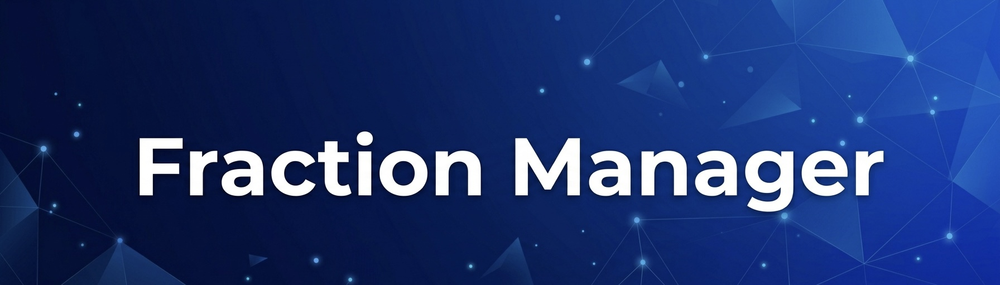

  

# 👮 Fraction Manager `v0.9.9 (Beta)`

---

**Автор:** *Newwer Hasegawa* **Статус проекта:** *Активное Beta-тестирование*.
> [!IMPORTANT]
> В настоящее время идет тест на использование скрипта несколькими игроками одновременно. 

---

> [!IMPORTANT]
> Скрипт работает только на проекте **Evolve Role Play**.

**Fraction Manager** - это профессиональная система автоматизации и управления фракцией. Скрипт полностью исключает необходимость ручного заполнения Google Таблиц, превращая игру в полноценный интерфейс управления базой данных в реальном времени.

---

### 📺 Видеообзор функционала
Для быстрого ознакомления с работой скрипта посмотрите краткую демонстрацию:

👉 **[Смотреть видеообзор](https://rutube.ru/video/private/a5166410342b431e8ea6b22e06ae5f0b/?p=yA-lqchrzs6dAOSaVMpJ9w)**

---

### ✨ Ключевые возможности

В скрипте реализована строгая **система ролей**. Доступ к функциям ограничен вашим рангом и отделом: обычный сотрудник не сможет управлять составом, а кадет будет видеть только свой прогресс.

#### 1. 🎓 Для Кадетов
Кадеты получают удобный инструмент для отслеживания своего обучения:
* **Прогресс обучения:** Просмотр информации о том, какие этапы пройдены (лекция, теория, практика и др.). Все отметки инструкторов моментально отображаются в меню.
* **Дата повышения:** Скрипт автоматически рассчитывает дату вашего повышения на основе правил департамента.

#### 2. 👤 Для всех сотрудников
Каждый сотрудник может в любой момент посмотреть актуальную информацию о себе:
* **Личная статистика:** Просмотр актуальной информации о себе: текущий отдел, количество наигранных часов и активные выговоры.
* **Дата повышения:** Проверка даты следующего повышения, проверка на выговоры.

#### 3. 👨‍🏫 Для Police Academy
Функционал для обучения и контроля:
* **Интерактивный список:** Динамический мониторинг кадетов в сети через HUD на экране с цветовой индикацией их успеваемости.
* **Умные лекции:** Автоматическое обновление лекций. Тексты подгружаются напрямую из GitHub, что гарантирует использование только актуальных материалов. Возможность остановить/продолжить лекцию по нажатию на клавишу.
* **Мгновенная синхронизация:** Любое действие инструктора (зачет, комментарий) сразу записывается в таблицу, отображается у других инструкторов и кадетов, а также дублируется в логи ВК.

#### 4. 🦅 Для Руководящего состава
**Полный отказ от таблиц.** Все действия по управлению составом теперь происходят прямо в игре:
* **Управление кадрами:** Перенос сотрудников между отделами и выдача выговоров в пару кликов через удобное меню. Скрипт сам найдет нужную строку и перенесет данные в таблицу.
* **Интерактивный список:** В окне управлением составом позволяет видеть список игроков, готовых к повышению(готов к повышению - ник окрашивается в зеленый цвет).
* **Автоматическая очистка выговоров:** Отчитывается время действия выговора и по истечению этого времени, выговор автоматически очищается.
* **Быстрый просмотр информации:** Возможность получить полную информацию о сотруднике, как через главное меню управления, так и по быстрой команде, в которой надо указать id игроука.

---

### 🤖 Возможности ВК-интеграции
Скрипт неразрывно связан с ботом в ВК:
* **Уведомления:** Мгновенная трансляция всех действий руководства и инструкторов (выговоры, повышения, переводы, зачеты кадетов) в общую беседу.
* **Мониторинг фракции:** Просмотр актуального онлайна (/members).
* **Личная статистика через ВК:** Запрос своей статистики, информацию о выговорах и срок до повышения, колличество наиграных часов.

---

### 🔄 Система обновлений
* **Авто-обновление скрипта:** Fraction Manager сам проверяет наличие новых версий на GitHub и обновляет компоненты до актуального состояния.
* **Динамические лекции:** Тексты лекций обновляются в облаке. Вам не нужно перекачивать скрипт, чтобы получить свежие правки в лекционном материале.

---

### 🛠 Установка

| Вариант | Инструкция |
| :--- | :--- |
| 📦 **Полный архив (Все в одном)** | Выберите файл **`AcademyHelper_Full.zip`** в списке выше и нажмите на иконку скачивания (Download raw file). Распакуйте содержимое в папку `moonloader` вашего клиента с заменой. |
| 📄 **Только скрипт (.lua)** | Выберите файл **`AcademyHelper.lua`** в списке выше и скачайте его через кнопку "Download raw file". Закиньте файл в папку `moonloader`. Требуется наличие всех библиотек. |

---

### 📚 Требования и библиотеки

Для корректной работы **Fraction Manager** убедитесь, что в вашей папке `moonloader/lib` присутствуют следующие компоненты:

* **Папки:** `samp` (SAMP.Lua), `game`.
* **Файлы:** `encoding.lua`, `vkeys.lua`, `fAwesome5.lua`.

> [!TIP]
> Если вы скачали **Полный архив**, все необходимые библиотеки уже включены в него.

---

### ⚠️ Статус стабильности (Beta)
На текущем этапе разработки версия **не является полностью стабильной**. Возможны критические ошибки, которые могут привести к:
* **Крашу скрипта** (остановка работы отдельных функций). Для перезапуска нажмите `Ctrl + R`.
* **Крашу всей игры** (вылет на рабочий стол).
* **Полному зависанию игры** (редкая критическая ошибка, при которой поможет только перезагрузка ПК).

**Что делать при ошибке?**
Если у вас произошел сбой, для исправления бага автору необходимы доказательства:
1. **Скриншот окна ошибки**, которое появляется при вылете игры.
2. **Скриншот или текст красного шрифта** из консоли **SAMPFUNCS** (открывается на клавишу `~`).
3. **Отправить информацию автору скрипта** - [https://vk.com/newwer](https://vk.com/newwer)

---

### 🎮 Управление и горячие клавиши

> [!CAUTION]
> **Важно:** Пожалуйста, не флудите нажатиями в меню или командой `/updc`. После взаимодействия подождите 2-3 секунды для прогрузки данных или пока отметка в меню не изменит свой цвет. ⏳

| Команда / Клавиша | Описание |
| :--- | :--- |
| `/fm` | Главное меню взаимодействия с скриптом |
| `/updc` | Принудительное обновление списка Кадетов из таблицы |
| `/updmembers` | Принудительное обновление общего списка из таблицы |
| **F5** | Включить / Выключить скрипт |
| **I** | Пауза / Продолжение чтения лекции |
| **Ctrl + R** | Перезагрузка скрипта |# FractionManager
